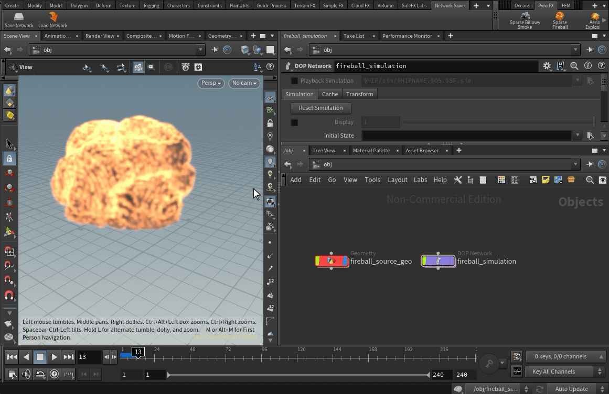

<div align="center">

# `Network Vault`

</div>

This project is meant to provide an easy, artist-friendly interface that allows 
users to save and distribute Houdini networks without the need to compile or 
parameterize them as an HDA. 

## Overview

Oftentimes one or more shot, asset, or sequence setups need to be shared across a 
department. This application takes care of storing and managing any number of 
Houdini networks across any number of users, and comes with a simple, artist-friendly UI. 

Networks are saved with a name and description, additionally saving the 
network category and version of Houdini they were created with in an effort to 
avoid any potential backward compatibility issues.

The location the network files are saved to is specified in data/vault_dir.txt,
and can be either a relative or absolute path to a location on disk.

## Saving Your Network

The Network Vault supports any number of nodes across all network categories. Simply select the nodes you wish to save, click on the Save Network shelf tool, and give your network a name and brief description.



## Loading a Network

Click on the Load Network shelf tool to open the network loading UI, then specify which user you would like to grab the network from. Ensure you're currently in the correct network category (i.e. when loading a SOP network, first navigate to the SOP context), then simply select and load the desired network. 


## Installation

The Network Vault can be installed like any other Houdini package, but there are a few extra steps to worry about.

1. Set the HFS and HPP environment variables to the desired version of Houdini. For example:
```
HFS = C:\Program Files\Side Effects Software\Houdini 19.5.435
HHP = C:\Program Files\Side Effects Software\Houdini 19.5.435\houdini\python3.9libs
```

2. Open `packages\\network_saver.json` and replace $NETWORK_SAVER_PATH with your installation location. Alternatively, set the NETWORK_SAVER_PATH environment variable to point to your installation location. For example:
```json
{
    "env": [
        {
            "HOUDINI_TOOLBAR_PATH": "C:\\Users\\houle\\Houdini_Projects\\hython\\network_saver\\packages\\toolbar"
        },
        {
            "PYTHONPATH": "C:\\Users\\houle\\Houdini_Projects\\hython\\network_saver\\packages\\python"
        }
    ]
}
```

3. Copy `network_saver.json` to `%HOUDINI_USER_PREF_DIR%\\packages`.

4. Enjoy!
